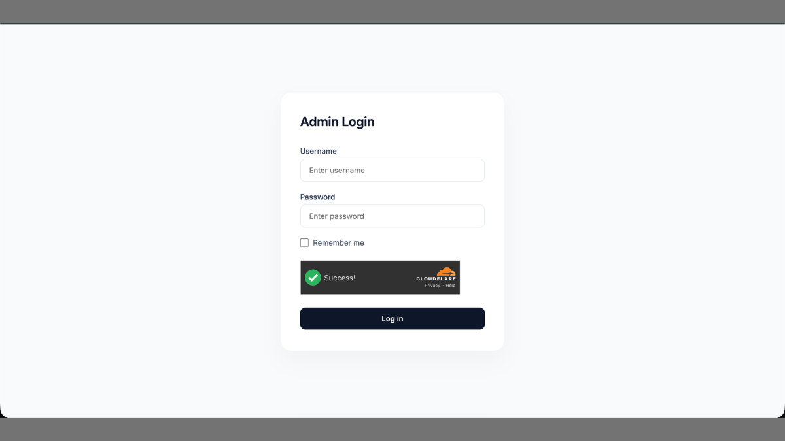
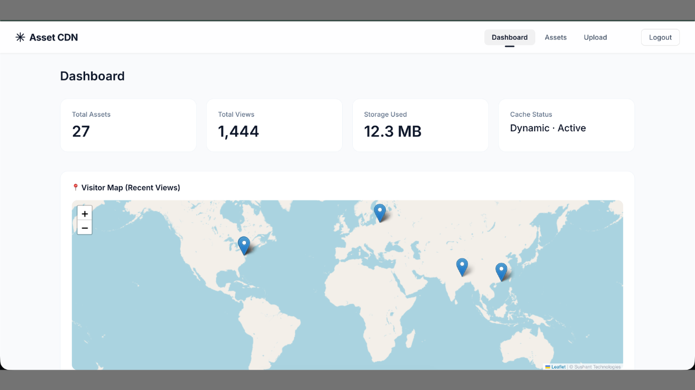
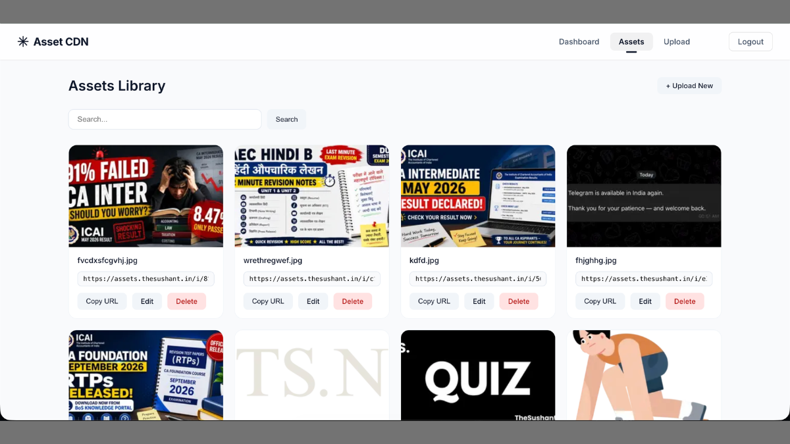
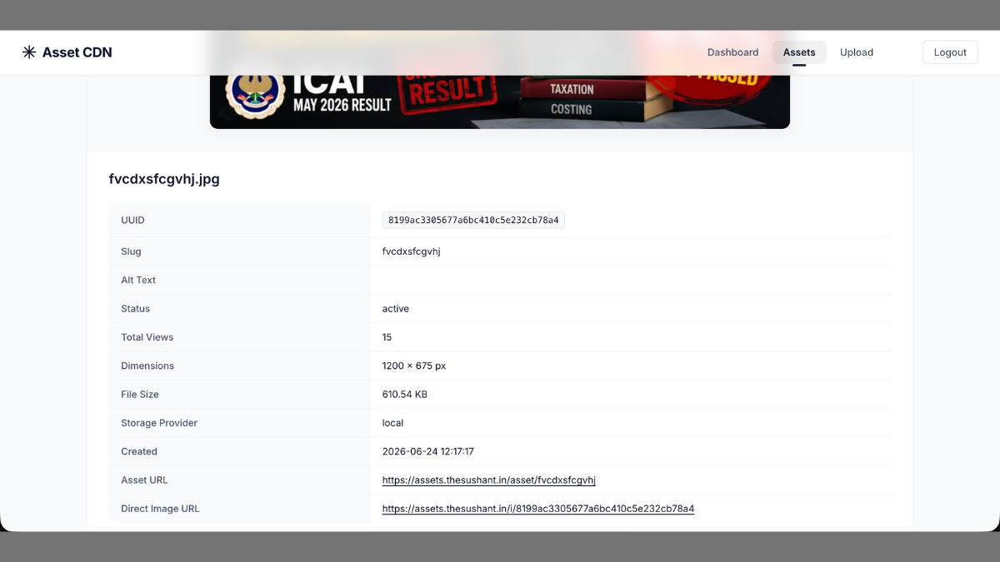
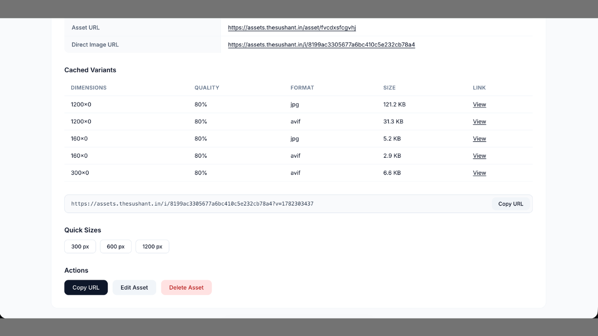
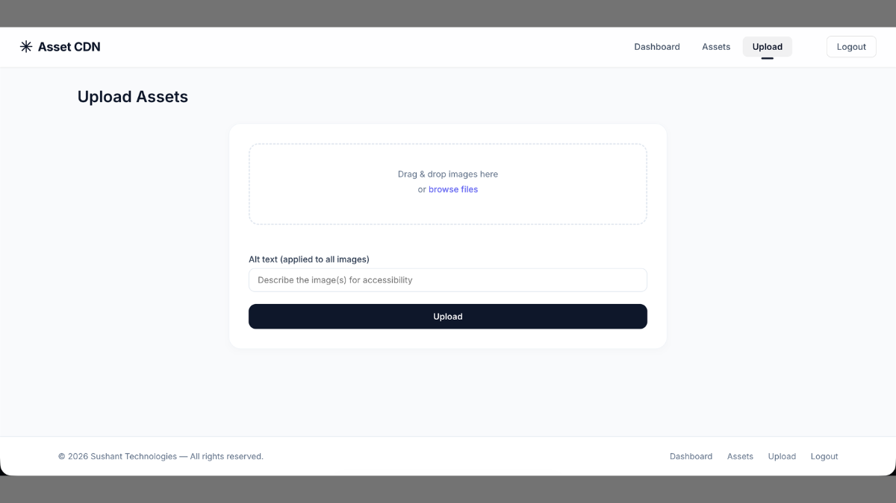

# Asset Delivery System

A production-ready asset management and image optimization platform built to simplify media uploads, automate image processing, and deliver optimized assets through a CDN-ready infrastructure.

---

## Overview

The Asset Delivery System was built to centralize media management for web applications while improving website performance through automatic image optimization and intelligent asset delivery.

Instead of manually creating multiple image sizes and formats, the platform automatically processes uploaded assets into modern formats such as WebP and AVIF while maintaining metadata, thumbnails, and optimized delivery URLs.

The system is designed for scalability and production use.

---

## Key Features

### Asset Management

* Secure administrator login
* Centralized asset library
* Upload and manage media files
* Asset metadata management
* Search and organization

### Image Processing

* Automatic WebP generation
* Automatic AVIF generation
* Thumbnail generation
* Multiple output sizes
* Intelligent quality optimization

### Asset Delivery

* CDN-ready asset URLs
* Dynamic image resizing
* Optimized image delivery
* Browser-compatible image serving
* Performance-focused architecture

### Infrastructure

* Metadata storage
* UUID-based asset management
* Scalable storage architecture
* Cloudflare CDN integration
* Cache-friendly asset delivery

---

## Technology Stack

* PHP
* MySQL
* HTML
* CSS
* JavaScript
* Image Processing Libraries
* Cloudflare CDN

---

## Screenshots

### Administrator Login



### Dashboard



### Asset Library



### Asset Details



### Asset Details (Extended View)



### Upload Interface



---

## System Architecture

```text
Client
      │
      ▼
Asset Upload
      │
      ▼
PHP Processing Engine
      │
      ├── Validate Upload
      ├── Generate WebP
      ├── Generate AVIF
      ├── Create Thumbnails
      ├── Store Metadata
      └── Generate Optimized URLs
      │
      ▼
MySQL Database
      │
      ▼
Cloudflare CDN
      │
      ▼
Optimized Asset Delivery
```

---

## Highlights

* Production-ready asset management system
* Automatic image optimization pipeline
* Modern image format generation
* Dynamic asset delivery
* CDN-ready architecture
* Built for performance and scalability

---

## Future Improvements

* Video asset support
* Object storage integration (Amazon S3 / Cloudflare R2)
* AI-powered image tagging
* Bulk optimization tools
* Usage analytics dashboard
* API access for third-party integrations

---

## Status

Production-ready system actively used for media management and optimized asset delivery.

---

## Author

**Sushant Kumar**

Portfolio:
https://thesushant.in/portfolio

Website:
https://thesushant.in
